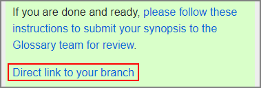
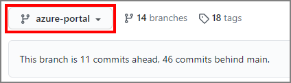
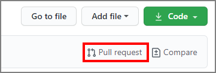
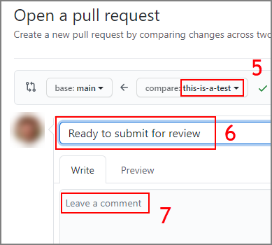
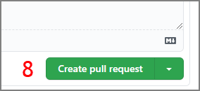

# Submitting a Synopsis for review

> Previous page: [Using the Synopsis Client](./getting-started-synopsis.md)

## Submitting the pull request

Once you are done editing the document, you should submit it for review. This is done with a process that GitHub calls `Pull request`.

> **VERY IMPORTANT** Make sure that all your changes are `committed to Cloud` before you submit the pull request.

1. Navigate to `https://github.com/lbugnion/ms-glossary/tree/your-term-name` where `your-term-name` is the file name you used to log into the Synopsis client.

> After you Commit to the Cloud in the Synopsis Client, the link will be shown to you.

2. Make sure that you are logged into GitHub.

> If you don't have a GitHub account, please contact [ms-glossary-help@microsoft.com](mailto:ms-glossary-help@microsoft.com)

3. Make sure that the correct `branch` is selected. You should see your file name here.

4. Press on `Pull request`.

5. Make sure again that your file name appears here.

6. Enter a title for your submission.
7. Optionally you can also enter a longer comment for the team.
8. Press the `Create pull request` button.

9. You should now see a confirmation page.

That's it, you have contributed your synopsis!! We will review your proposal and contact you to coordinate the next steps.

## What should you do if you still want to make changes?

If you submitted for review too early and still want to make changes, [please contact us](mailto:ms-glossary-help@microsoft.com).

> Previous page: [Using the Synopsis Client](./getting-started-synopsis.md)
