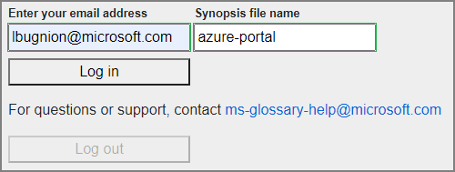
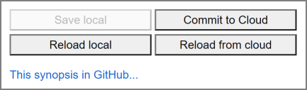
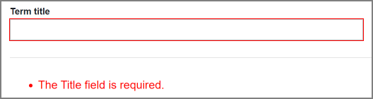
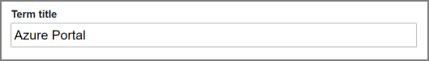
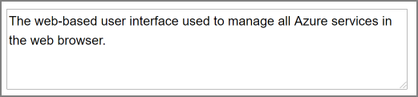
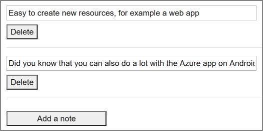
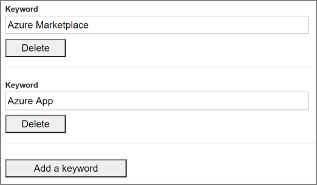
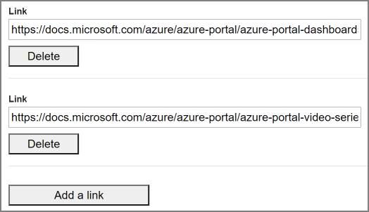
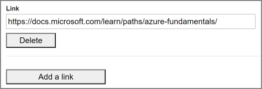

# Using the Synopsis client

> Previous page: [Creating content for the Glossary: Getting started](./getting-started.md)

> Next page: [Submitting a Synopsis for review](./getting-started-synopsis-review.md)

## Introduction

In this step you will use an application called the Synopsis Client. It runs like a web page on your computer and on your phone, at the following address: [Synopsis Client](https://www.ms-glossary-synopsis.cloud).

> You can also get to this application by clicking on the link in the email you received (recommended).

*Synopsis client in landscape mode*:

*Synopsis client on mobile phone*

> Click on name of the section to get more detailed information and Screenshots. 

- [Logging in](#logging-in): Before you start you will need to log into the client.
- [Title](#title): The Synopsis title, which is usually also the name of the page that will be created in the Glossary for this term.
- [Authors](#authors) : one or more author for the Synopsis.
- [Description](#short-description) : A short description we'll use later in the video.
- [Phonetics](#phonetics): The phonetic transcription of the term.
- [Notes](#personal-notes): Personal notes to help you getting started and keeping track of your progress.
- [Keywords](#keywords-or-key-expressions): Keywords that we'll use later to cross reference terms. [See the definition of a keyword](/getting-started.md#keyword).
- [Demos](#demos): A list of demos that you want to use in the video.
- [Links to Docs](#links-to-docs): A list of links leading to the Microsoft Docs.
- [Links to Learn](#links-to-learn): A list of links leading to Microsoft Learn learning paths and modules.
- [Other Links](#other-links): A list of links leading to other destinations, either on Microsoft' properties or elsewhere.
- [Script](#script): The script for your video.

## Logging in

You need to log into the Synopsis client when you want to edit a term. The login process needs two pieces of information:

- Your email address: This must be the same email address defined in the Synopsis. After you log in, you have the possibility to change this address in the `authors` section. You can also add other authors as needed.
- The name of the file you want to edit.

> We ask that you enter the file name and NOT the synopsis title. The file name is the last part of the URL you received in the confirmation email. For example in `https://www.ms-glossary-synopsis.cloud?edit=azure-portal`, the file name is `azure-portal`.

> After you are logged in, you can also log out. However please note that logging out will lose all your local changes. Make sure to `Commit to cloud` before you log out.

## Common elements

Each screen has the following elements in common:

- `Save local`: This button is enabled when the Synopsis can be saved in local storage. You can take your time to edit the Synopsis and save your changes in the mean time before you are ready to save to the cloud.
- `Commit to Cloud`: This will save the Synopsis you are editing to GitHub. This doesn't however submit it for review yet. You can save to the Cloud as often as you need.

> When you commit to the Cloud, you have to enter a message which will be saved to GitHub as well.

- `Reload local`: This will cancel all your unsaved changes and reload the last version of the Synopsis that you saved locally.
- `Reload from Cloud`: This will cancel all your local changes, connect to GitHub and reload the Synopsis from there.

> Be careful when reloading from the Cloud, all your local changes will be erased, even the ones you saved locally!!

- `This synopsis in GitHub` leads you to the markdown file for your Synopsis as it is available in GitHub.

### Validation

Some fields are optional, others need to be filled. You will see validation messages where needed. For example:

## Title

This is where you update the title of the Synopsis. This will be the term shown on the Glossary page. For example `App service`, `Azure Portal` etc.

> Changing the title of the synopsis does NOT change its address. For example if you are editing https://ms-glossary-synopsis.cloud?edit=azure-portal and you change the title from `Azure Portal` to `Microsoft Azure Portal`, the link above remains unchanged.

## Authors

You have already entered your information when you submitted the getting started form. Here you can modify your information, add or remove some authors.

> Note that **at least one author** must be defined.
> Each author must have a **name, email address and Twitter username** defined. Optionally an author's GitHub username can also be defined.

## Short Description

You should see here the Short Description that you entered in the form. It will be used later in the social videos, in the title card.

> IMPORTANT **Please keep the Short Description between 40 and 150 characters**.

## Phonetics

We show a phonetic transcription of the term to create a feeling of being in a dictionary.

You can easily create the phonetics with the following steps:

1. Go to [https://tophonetics.com](https://tophonetics.com/).
2. Paste or type your english text in the box.

3. Make sure that `American` is selected. This is just to ensure that we have consistent phonetics through all the entries.
4. Click on `Show Transcription`.
5. Copy the transcription.
6. Paste the transcription in the Synopsis client.

> The Phonetics field is required.

## Personal notes

This section is intended as a notepad where you can quickly jot down some ideas about the video. For example when doing some research online, this is a convenient place to create a bullet points list, and to consult it later when you create the script.

Use the `Delete` button to delete a note.

> You can delete all the notes if you want, however each note needs to have some text defined.

## Keywords or key expressions

The list of keywords will be used to cross-reference items within the Glossary. They can be one word, a short expression, 2-3 words. They can also be abbreviations.

For example, if you have this list of keywords in the app-service.md file:

`Web Server, Web API`

and another page has this text:

`[...] and you can install this application on a web server locally or in the cloud [...]`

then after processing, the text becomes

`[...] and you can install this application on a [web server](/glossary/term/app-service/web-server) locally or in the cloud [...]`

> A given keyword or key expression can be used in multiple pages. In that case a disambiguation page will be created to help the user choose which page he wants to read.

## Demos

We try to illustrate each term with some small "demos" (note the quote signs here...). By this we mean that the demos are not necessarily aimed at showing a technical solution, but rather to illustrate the point you are making. The demos should be short (a few seconds), for example a quick action in the Azure portal, a navigation through some items, some screenshots, etc.

For "on camera" scenes, you can also add some logos in overlay to make things more interesting.

You can see a few examples of "demos" below.

> Click on the animated GIF to see the video

*Demo 1: Showing logos on the camera*

*Demo 2: Using callouts to attract attention*

*Demo 3: Showing logos on screen*

*Demo 4: Showing the Azure Portal*

*Demo 5: Fun with fingers*

*Demo 6: Animating screenshots*

## Links to Docs

One of the goals of this project is to drive traffic to the Microsoft documentation and Learn pages. For each term, you should provide a list of Docs and Learn links.

> You need to define at least one link to Microsoft Docs. Each link will be instrumented with information allowing us to track the clicks. You don't have to worry about that at the moment.

## Links to Learn

Similarly to Docs links, we also ask you to provide a list of Microsoft Learn links, in order to drive traffic to these modules.

You can either provide a link to a Learning path, or to a specific module, or both.

> You need to define at least one link to Microsoft Learn. Each link will be instrumented with information allowing us to track the clicks. You don't have to worry about that at the moment.

## Other links

You can also provide other links, for example links to other Microsoft properties, or third party websites (blog articles, app store, etc etc). Note that non-Microsoft links cannot be tracked.

> Links to Microsoft Docs and Microsoft Learn are required, however other links are optional.

## Script

> For the script, we recommend aiming for **280 - 320 words** for the 2 minutes video. After you change a line of script, click out of the field to see the new word count.

> The script is composed of lines of script (which you will say on camera) and production notes (which are just indications for you to make it easier to film or to edit). In the Synopsis client, production notes have a black background.

The most important part of the synopsis, and the one you'll spend the most time creating, is the script.

All Microsoft Glossary videos are scripted. This serves a few purposes:

- Help us review the video before it is even created.
- Help you create videos that are short (below 2:20 so they can be posted to Twitter) and to the point.
- Help create captions for the videos.

You can see examples of scripts [here](../synopsis/aad.md#script) and [here](../synopsis/app-service.md#script). Here are some tips:

- Keep it simple. Start by writing what you want to say, then go over the script again and remove unnecessary words, repetitions, etc. Going through the script a few times will make it tighter and better.

- Add production notes. These notes will be useful for you later when you are ready to record. For example:

> Speak to the camera

or

> Show the portal on the application insights dashboard

Don't worry, we will also review the script and help you get it right before filming the video :)

> Previous page: [Creating content for the Glossary: Getting started](./getting-started.md)

> Next page: [Submitting a Synopsis for review](./getting-started-synopsis-review.md)
