# Creating content for the Glossary: Getting started

Thank you so much for contributing to the Glossary. With your help, we can grow and maintain the content to create a reference repository of words, expressions and abbreviations.

## Definitions

### Term

A Term is a Glossary entry. A Term can be a simple word (for example `serverless`), an expression or group of words (for example `app service`) or an abbreviation (for example `tls/ssl`). It can be a product name (for example `Azure Active Directory`) or a technological expression related to Microsoft products and services (for example `web server`).

### Page

A Term translates to a Page in the Glossary. For example the Term `app service` is explained [in this page](https://aka.ms/define/app-service).

### Keyword

A Keyword is a Term that is defined in the Glossary but **doesn't have its own page**. In the Glossary, when a Keyword is clicked, we redirect the reader to the related Page. For example [Encryption](https://aka.ms/define/encryption) is a Keyword which redirects to the Page titled `TLS/SSL`.

> When a Keyword redirects to a Page, the words `(redirected from [keyword])` are shown in the title.

### Synopsis

The Synopsis is a document where the author for a new Term defines the information that will be used to publish the Term to the Glossary, and to create the social video that accompanies it. When you [register to define a new Term](https://aka.ms/define/new), the process will create a new draft Synopsis.

The Synopsis has two main goals:

- Help us understand your project so that we can approve it as fast as possible.

- Help you plan your video so that the recording session and the editing go as easy and smoothly as possible.

You can write the Synopsis by following the process described below in this document.

> You can see [an example of completed Synopsis here](https://aka.ms/glossary/sample/synopsis).

## What should you do first?

If you have not done this already, [you should submit the "New term" form](https://aka.ms/define/new).

After you submit this form, you will get an email with a link to the new Synopsis. You can then fill the sections. Follow the instructions below!

## Completing the synopsis

At this point you should have received an email with instructions about the next steps. The email has a link pointing you to a new file that was created in the Microsoft Glossary GitHub repository. This is where you will spend most of your time during this phase of the work.

You can choose between two ways to complete the Synopsis:

- [Working on a copy of the file locally, and then submitting through the web UI](#working-with-the-github-web-ui)
- [Forking and cloning the repo locally, then editing in Visual Studio Code]()

The synopsis is written in the Markdown language, a very simplified version of the HTML language. [More information about Markdown can be found here](https://www.markdownguide.org/).

### Working with the GitHub web UI

You can edit the synopsis directly in the GitHub portal. Creating the synopsis should take you about 1-2 hours.

> **VERY IMPORTANT** Make sure that all your changes are in the document before you submit the pull request. Once you submit the pull request, you cannot change the file anymore until it is approved.

1. Click on the link in the email that you receive.

> If you didn't receive an email after submitting the new term, check your junk folder. The email is titled `ACTION NEEDED: Thanks for submitting to the Microsoft Glossary`. If you still cannot find it, contact [ms-glossary-help@microsoft.com](mailto:ms-glossary-help@microsoft.com).

The links should look something like that:

`https://github.com/lbugnion/ms-glossary/blob/{new-term}/synopsis/{new-term}.md`

2. Click on the `Edit this file` button, represented by a small pencil icon on the top right above the document's title. **Note that the button will be disabled if you are not logged into GitHub**.

3. Copy the content of the markdown file and paste into a text editor of your choice (for example [Visual Studio Code](https://code.visualstudio.com/Download)).

4. Complete the Synopsis file [as detailed here](./getting-started-synopsis.md). Make sure to save the file locally to avoid losing information.

5. Once you are done with your edit work, copy the content of the markdown file and go back to the document in GitHub using the link you received in the email.

6. Press the `Edit this file` button (the small pencil) again. **Note that the button will be disabled if you are not logged into GitHub**.

7. Replace the current content of the document with the one you just copied.

At this point you are ready to submit your document for review. This is what GitHub calls a `pull request`. Follow the steps:

### Submitting the pull request (GitHub web UI)

Once you are done editing the document, you should submit it for review. This is done with a process that GitHub calls `Pull request`.

> **VERY IMPORTANT** Make sure that all your changes are in the document before you submit the pull request. Once you submit the pull request, you cannot change the file anymore until it is approved.

1. Scroll down to the bottom of the page.
2. Enter a comment for the proposed change.
3. Press the `Propose changes` button.

4. In the next window, you will see the differences between the original document and your changes.
5. If you are still satisfied, press the `Create pull request` button.

6. Enter a comment about your changes and then press the `Create pull request` button again.

7. You should now see a confirmation page.

That's it, you have contributed your synopsis!! We will review your proposal and contact you to coordinate the next steps.

## Forking and cloning the repository locally

If you prefer, you can get the ms-glossary repo locally to edit the files with your favorite editor such as Visual Studio Code. Follow the steps:

> This section assumes that you have Visual Studio Code as well as the GitHub Pull Requests and Issues extension installed on your machine. For more information see [Working with GitHub in VS Code](https://code.visualstudio.com/docs/editor/github).
> You will also need Git of course, [which you can install from here](https://git-scm.com/).

### Getting the repo

1. Go [to the GitHub repo](https://github.com/lbugnion/ms-glossary).
2. Click on the Fork button.

> IMPORTANT: If you already had a previous copy of the repo forked to your account, you might not have the latest changes. In that case, go to [Updating the repo](#updating-the-repo) and follow the steps.

3. Open a new empty instance of Visual Studio Code.
4. Click on the Source Control extension in the toolbar on the left.
5. If necessary, sign in into GitHub.

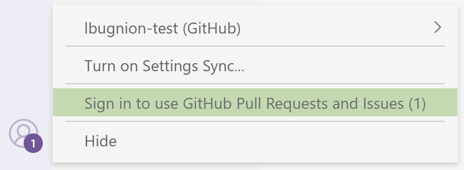
 
6. Click on `Clone Repository`.

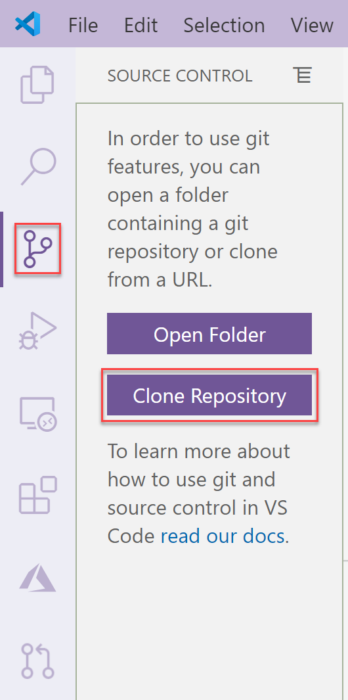

7. Click on `Clone from GitHub`.

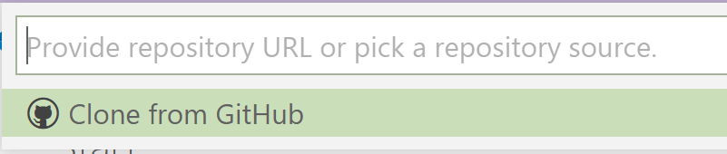

8. If necessary, follow the instructions to sign into GitHub.
9. Select the ms-glossary fork.

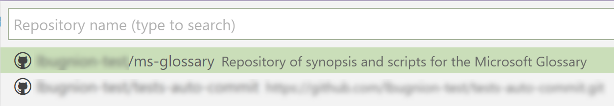

10. Select the folder where you want the files to be copied.

### Getting and editing the Synopsis

1. After the cloning process is done, open the folder in Visual Studio Code.
2. Select the branch you just created, with the new term. Note that this branch will be prefixed with `origin/` for example `origin/my-new-term`.

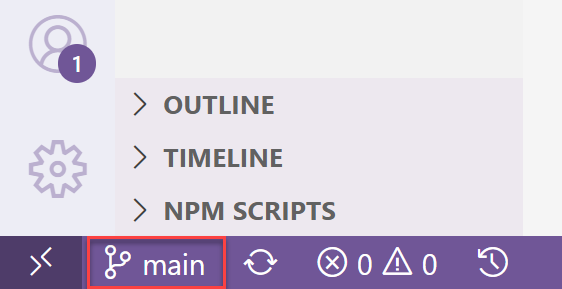

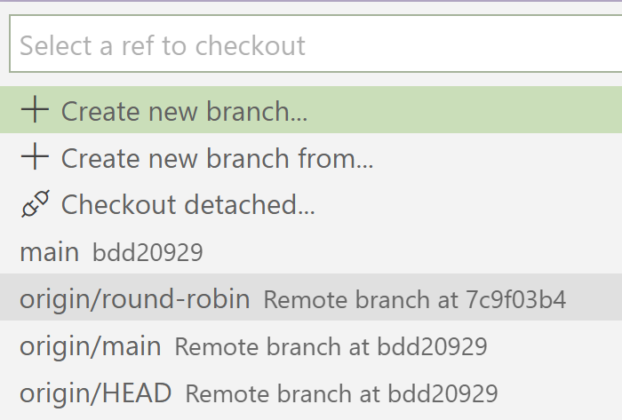

3. Expand the `Synopsis` folder in the file explorer and locate the markdown file that corresponds to your term.

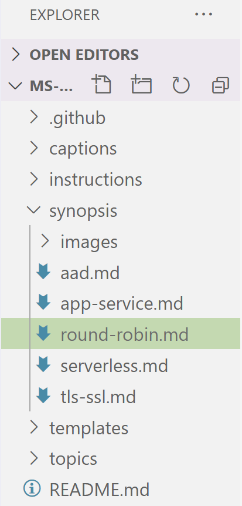

At this point you can take your time to edit the file, save your changes, etc. 

1. Save your changes.
2. Open the `Source Control` extension.

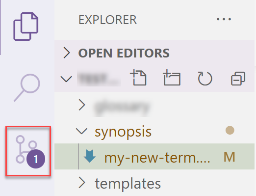

3. Click on the file to see the changes in the difference editor.
4. Click on the `+ (Stage)` button.

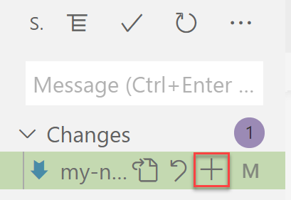

5. Enter a commit message and then click on the `Commit` button.

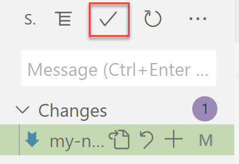

6. Click on the menu button and then select `Push`.

At this time, your changes are safely committed to your own fork of the ms-glossary repository. You can continue to make changes, or you can go to the next step and submit the pull request.

### Submitting the pull request (Visual Studio Code)

> IMPORTANT Only proceed with the pull request when you are done with all your changes. This will trigger a review process and we will contact you for next steps. If you submit too fast and want to make additional changes, contact [ms-glossary-help@microsoft.com](mailto:ms-glossary-help@microsoft.com).

This process will submit your synopsis for review to the Microsoft Glossary team. Please follow the steps.

1. Make sure that all your changes are saved and committed to your fork of the repository (see steps above).
2. Open your fork of the ms-glossary repo in a web browser.

> For example https://github.com/[your-github-name]/ms-glossary

3. Use the combobox to set the branch to the term you are authoring.

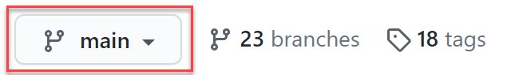

4. With the correct branch selected, press the `Pull request` button.

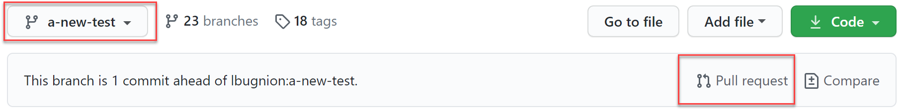

5. Make sure that both comboboxes are set to the branch of the term you are authoring.

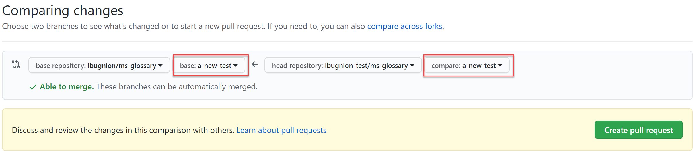

> At this point if you scroll down you can see the changes that you will be proposing.

6. Press the `Create pull request` button.

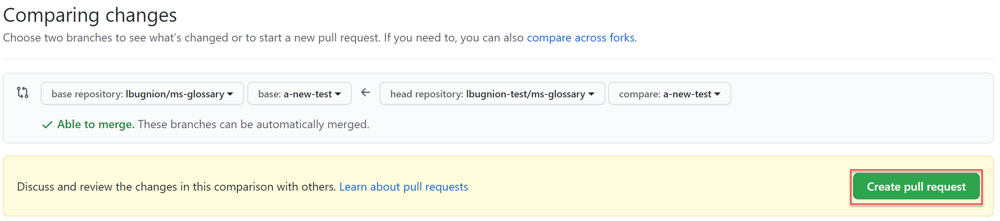

7. Enter a title for your changes. You can also enter a comment if you want to communicate anything to the review team.

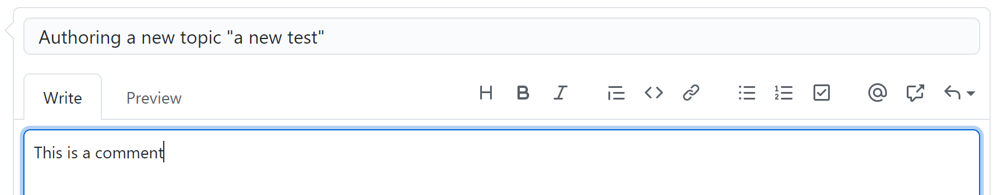

At this point, you can congratulate yourself for the good job. The review team will check your work and discuss potential changes with you. As soon as we are ready, you will be able to record your video, and the new term will make it into the Glossary.

### Updating the repo

If you already had a fork of the repo in your account, it might not have the latest changes that were just created.

The easiest way is to **just delete your local copy in GitHub and locally**, and then to fork again following the instructions above. **However you might lose local changes so be careful**. Make sure to backup all your files.

Alternatively, you can also [follow these steps](https://docs.github.com/en/free-pro-team@latest/github/collaborating-with-issues-and-pull-requests/syncing-a-fork).
