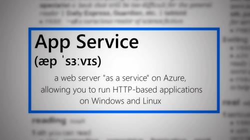

# Creating content for the Glossary: Getting started

Thank you so much for contributing to the Glossary. With your help, we can grow and maintain the content to create a reference repository of words, expressions and abbreviations.

## Definitions

### Term

A Term is a Glossary entry. A Term can be a simple word (for example `serverless`), an expression or group of words (for example `app service`) or an abbreviation (for example `tls/ssl`). It can be a product name (for example `Azure Active Directory`) or a technological expression related to Microsoft products and services (for example `web server`).

### Page

A Term translates to a Page in the Glossary. For example the Term `app service` is explained [in this page](https://aka.ms/define/app-service).

### Keyword

A Keyword is a Term that is defined in the Glossary but **doesn't have its own page**. In the Glossary, when a Keyword is clicked, we redirect the reader to the related Page. For example [Encryption](https://aka.ms/define/encryption) is a Keyword which redirects to the Page titled `TLS/SSL`.

> When a Keyword redirects to a Page, the words `(redirected from [keyword]) are shown in the title.

### Synopsis

The Synopsis is a document where the author for a new Term defines the information that will be used to publish the Term to the Glossary, and to create the social video that accompanies it. When you [register to define a new Term](https://aka.ms/define/new), the process will create a new draft Synopsis.

The Synopsis has two main goals:

- Help you plan your video so that the recording session and the editing go as easy and smoothly as possible.

- Help us understand your project so that we can approve it as fast as possible.

You can complete the sections following the process described below in this document.

> You can see [an example of completed Synopsis here](https://aka.ms/glossary/sample/synopsis).

## What should you do first?

If you have not done this already, [you should submit the "New term" form](https://aka.ms/define/new).

After you submit this form, you will get an email with a link to the new Synopsis. You can then fill the sections. Follow the instructions below!

## Completing the synopsis

At this point you should have received an email with instructions about the next steps. The email has a link pointing you to a new file that was created in the Microsoft Glossary GitHub repository. This is where you will spend most of this phase of the work.

> Creating the synopsis should take you about 1-2 hours.

Click on the link in the email that you receive.

> If you didn't receive an email after submitting the new term, check your junk folder. The email is titled `ACTION NEEDED: Thanks for submitting to the Microsoft Glossary`. If you still cannot find it, contact [LBugnion@microsoft.com](mailto:LBugnion@microsoft.com).

The links should look something like that:

`https://github.com/lbugnion/ms-glossary/blob/{new-term}/synopsis/{new-term}.md`

The synopsis has the following sections that you should fill before submitting it for review:

### Submitted by

You have probably already entered your information [when you submitted the form above](#form). We need the following:

- Your name
- Your email address
- Your Twitter username
- Your GitHub username

### Short Description

You should see here the Short Description that you entered in the form. It will be used later in the social videos, in the title card. You can see an example here:

.

> Please keep the Short Description to about 25 words maximum.

## Phonetics

The goal of showing a phonetic transcription of the word is to create a feeling of being in a dictionary. You can easily create a new phonetics PNG with the following steps:

1. Go to [https://tophonetics.com](https://tophonetics.com/).
2. Paste your english text in the box.

3. Make sure that `American` is selected. This is just to ensure that we have consistent phonetics through all the entries.
4. Click on `Show Transcription`.
5. Copy the transcription.
6. Include the transcription into your Synopsis markdown.

### Personal notes

This section is intended as a notepad where you can quickly jot down some ideas about the video. For example when doing some research online, this is a convenient place to create a bullet points list, and to consult it later when you create the script.

## Keywords or key expressions

The list of keywords will be used to cross-reference items. They can be one word, a short expression or 2-3 words. They can also be abbreviations.

> You don't need to add the term's title (for example `App Service`) to the list of keywords, this will be added automatically).

For example, if you have this list of keywords in the app-service.md file:

`Web Server, Web API`

and another topic file has this text:

`[...] and you can install this application on a web server locally or in the cloud [...]`

then after processing, the text becomes

`[...] and you can install this application on a [Web Server](/topic/app-service_web-server) locally or in the cloud [...]`

> A given keyword or key expression can be used in multiple topics. In that case a disambiguation page will be created to help the user choose which topic he wants to read.

## Demos

We try to illustrate each topic with some small "demos" (note the quote signs here...). By this we mean that the demos are not necessarily aimed at showing a technical solution, but rather to illustrate the point you are making. The demos should be short (a few seconds), for example a quick action in the Azure portal, a navigation through some items, some screenshots, etc.

For "on camera" scenes, you can also add some logos in overlay to make things more interesting.

You can see a few examples of "demos" below.

> Click on the animated GIF to see the video

*Demo 1: Showing logos on the camera*

*Demo 2: Using callouts to attract attention*

*Demo 3: Showing logos on screen*

*Demo 4: Showing the Azure Portal*

*Demo 5: Fun with fingers*

*Demo 6: Animating screenshots*

## Links to Docs

One of the goals of this project is to drive traffic to the Microsoft documentation and Learn pages. For each topic, you should provide a list of Docs and Learn links.

Each link will be instrumented with information allowing us to track the clicks. You don't have to worry about that however. In the synopsis document, simply list the links, for example:

- [App Service overview](https://docs.microsoft.com/azure/app-service/overview)
- [App Service documentation](https://docs.microsoft.com/azure/app-service)

## Links to Learn

Similarly to Docs links, we also ask you to provide a list of Microsoft Learn links, in order to drive traffic to these modules. 

You can either provide a link to a Learning path, or to a specific module, or both.

For example:

- [Deploy a website to Azure with Azure App Service](https://docs.microsoft.com/learn/paths/deploy-a-website-with-azure-app-service) *(learning path)*
- [Capture Web Application Logs with App Service Diagnostics Logging](https://docs.microsoft.com/learn/modules/capture-application-logs-app-service) *(module)*
- [Create and publish a web application with Azure App Service and Visual Studio Code](https://docs.microsoft.com/learn/modules/create-publish-webapp-app-service-vs-code) *(module)*

## Script

Maybe the most important part of the synopsis, and the one you'll spend the most time creating, is the script.

All Microsoft Glossary videos are scripted. This serves a few purposes:

- Help us review the video before it is even created.
- Help you create videos that are short (below 2:20 so they can be posted to Twitter) and to the point.
- Help you captions for the videos.

You can see examples of scripts [here](../synopsis/aad.md#script) and [here](../synopsis/app-service.md#script). Here are some tips:

- Keep it simple. Start by writing what you want to say, then go over the script again and remove unnecessary words, repetitions, etc. Going through the script a few times will make it tighter and better.

- Add production notes as a `> blockquote`. These notes will be useful for you later when you are ready to record. For example:

> Speak to the camera

or

> Show the portal on the application insights dashboard

If you have images, screenshots etc, add them to the script too (you can save the images in the [synopsis/images](../synopsis/images/) folder). Any information you add to the script will be helpful later when recording the video.

Don't worry, we will also review the script and help you get it right before filming the video :)

### Structure of the "Azure word of the day" videos

> TODO Continue

> "Azure Word of the Day" is a series of videos featured in the Glossary to help illustrate a term. Note that these are obviously suitable for Azure-related topics only. For other areas of Microsoft, we can use a different kind of videos.

[Here is an example of a social video for Azure Word of the Day](https://aka.ms/define/app-service).

The videos all have a common structure that make them easy to recognize. These videos are suitable for social media so **they must be shorter than 2 minutes and 20 seconds**. In fact we recommend **aiming for 2 minutes only**.

Each video starts with the intro card featuring a jingle.

Then the term is shown, as well as its phonetic transcription, and the short description.

> The short description is the one you entered in the Microsoft Form when you got started. It can be edited in the synopsis

> For later -----------------------------

## Getting the repository locally

### With command line

### With Visual Studio Code

## Supported syntax (for Docs)

- Notes, important etc

> WORK IN PROGRESS
