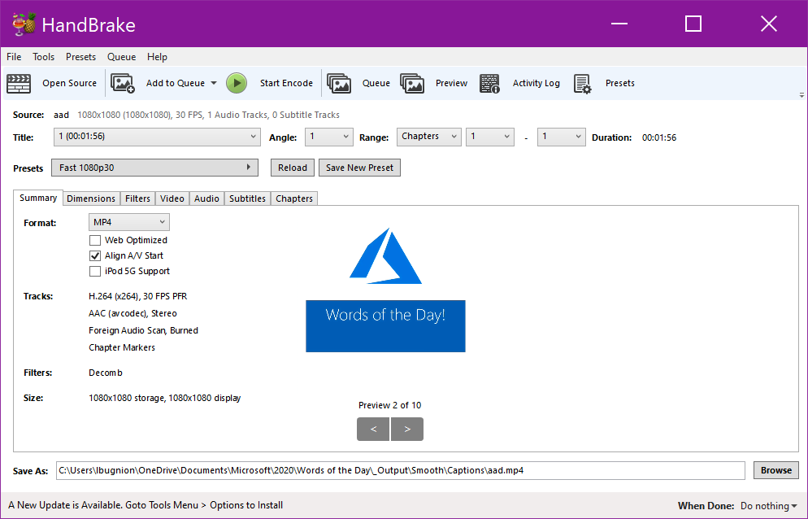
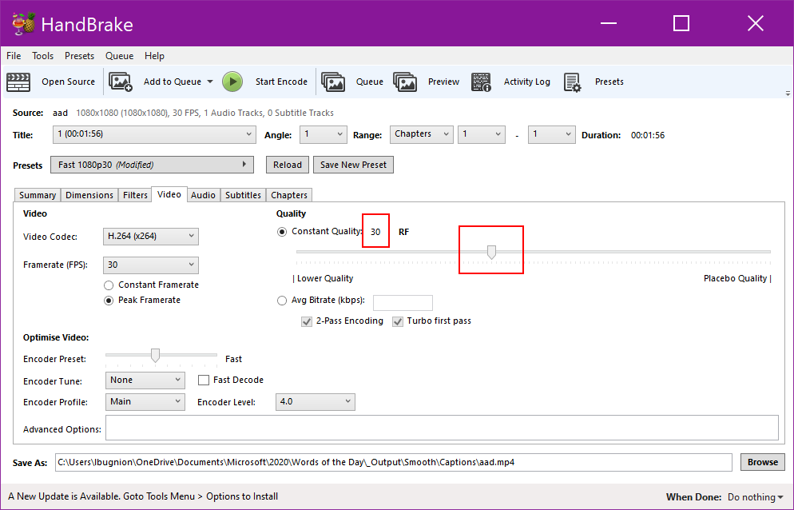
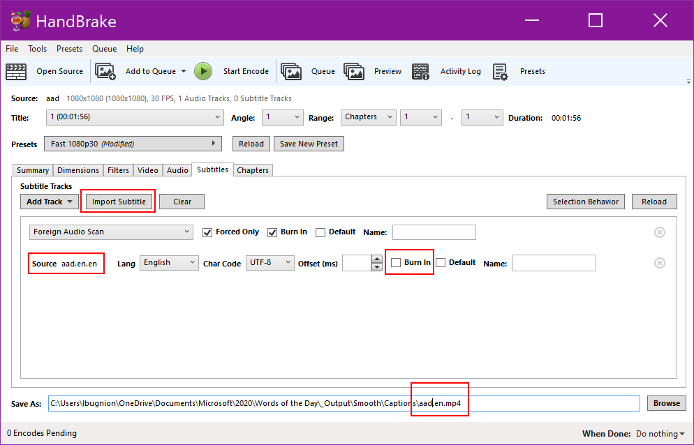
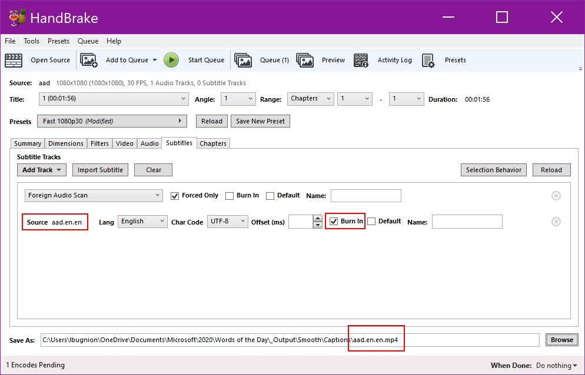
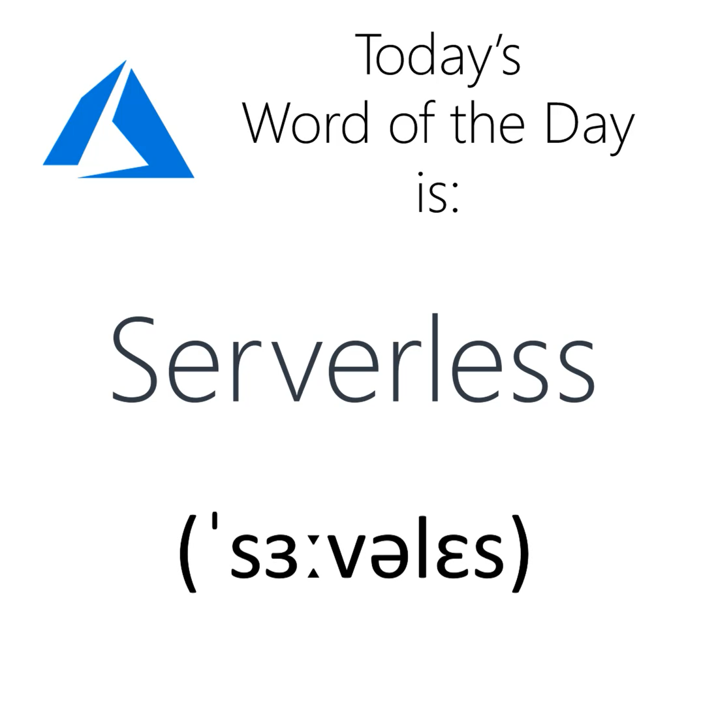

# Notes for the publisher

> TODO Add a chapter about using the staging environment

## Publishing a new video

- On [Github](https://github.com/lbugnion/ms-glossary), check the branch `TERM` out, where `TERM` is the current term, for example `app-service`, `serverless`, `aad` etc.

> Most probably the branch already exists from when the synopsis was created. If it doesn't, or if you want to start fresh, just create a new branch with a similar name.

- Update the synopsis (in the [Synopsis folder](../synopsis))

- Edit the video and produce it.

|Part|Text|Behavior|
|---------|---------|---------|
|Video title|Segoe UI Semibold, Regular, 148|Hinge, Text Left to right, Spring, Bottom, Tension 5.00, Offset 0.05s|
|Video phonetics|Segoe UI Semibold, Regular, 101|Fade in, Text Left to Right, Linear, 83%, Offset 0.05s|
|Video short description|Segoe UI, Regular, 66|Fade in, Text Left to Right, Linear, 100%, Offset 0.05s|

- Create the captions file(s) (*.srt).
  - Caption files are saved in the [Captions folder](../captions).
  - Link to [Subtitle Edit for Windows](https://www.nikse.dk/SubtitleEdit/).

- Create the term file (under [the Terms folder](../terms/)).

- Produce the video with embedded captions [with Handbrake](https://handbrake.fr/).
  - [See the Handbrake settings here](#handbrake)

- Upload the video with captions [in the Videos containers](http://gslb.ch/462).
  - If you don't have access to the Storage container, contact LBugnion@microsoft.com

- Publish the new video to YouTube.
  - [Instructions for YouTube](#youtube)

- Copy the new YouTube video code into the Term file under `> YouTube: CODE`

> The YouTube code is what comes at the end of the YouTube URL. For example in `https://youtu.be/O3KuatPZjfs`, copy only the code `O3KuatPZjfs` to the Term file.

- Double check everything, then commit the modified synopsis, captions and the Term file to the new branch.

> Before you push to Github, we have a staging environment that you can use to try things out. Please contact LBugnion@microsoft.com for details.

- Push to GitHub

- Merge the new branch into Master and push to GitHub. This will trigger the website update.

## Updating an existing video

- On [Github](https://github.com/lbugnion/ms-glossary), create a new branch "TERM-update-nn" where
  - TERM is the current term, for example `app-service`, `serverless`, `aad` etc.
  - nnn is an index to differentiate branches with similar names.

- Update the synopsis (in the [Synopsis folder](../synopsis))

- Edit the video and produce it.

- Update the captions file(s) (*.srt).
  - Caption files are saved in the [Captions folder](../captions).
  - Link to [Subtitle Edit for Windows](https://www.nikse.dk/SubtitleEdit/).

- Update the term file (under [the Terms folder](../terms/)).

- Produce the video with embedded captions [with Handbrake](https://handbrake.fr/).
  - [See the Handbrake settings here](#handbrake)

- Upload the video with captions [in the Videos containers](http://gslb.ch/462).
  - If you don't have access to the Storage container, contact LBugnion@microsoft.com

- Publish the new video to YouTube.
  - [Instructions for YouTube](#youtube)

> Because of YouTube constraints, there is no way to update an existing video, you must publish it as a new video.

- Copy the new YouTube video code into the Term file under `> YouTube: CODE`

> The YouTube code is what comes at the end of the YouTube URL. For example in `https://youtu.be/O3KuatPZjfs`, copy only the code `O3KuatPZjfs` to the Term file.

- Double check everything, then commit the modified synopsis, captions and the Term file to the new branch.

> Before you push to Github, we have a staging environment that you can use to try things out. Please contact LBugnion@microsoft.com for details.

- Push to GitHub

- Merge the new branch into Master and push to GitHub. This will trigger the website update.

- Once you verified that the site has been updated, delete the old YouTube video

## Handbrake settings

> Add this to the queue then change the burn in setting. The file name is `[term].[spoken language].mp4`, for example `aad.en.mp4`.

> Add this to the queue too then Start the queue. The file name is `[term].[spoken language].[caption language].mp4`, for example `aad.en.en.mp4`.

## YouTube settings

### Title

Azure Words of the Day: TERM

### Description

Hello and welcome to Microsoft Azure Words of the Day, the show that teaches you the Azure vocabulary!

Today's words of the day are: TERM

More information, links etc:
LINK

> Use the friendly shortened link here, for example `https://aka.ms/define/serverless`.

### Other settings

- Thumbnail: Upload a thumbnail looking like this:

- Audience: No it's not made for kids
- Age restriction: None
- Visibility: Unlisted
- Playlists: Azure Words of the Day
- No end screen
- No cards

#### More options

- Recording date: Set
- Video location: None
- License: Creative Commons - Attribution
- Category: Science & Technology
- Original video language, subtitles and CC: Set
- Caption certification: None

- **Upload the captions file (SRT) here.**
  - With Timing

- Hold potentially inappropriate comments for review
- Users can view ratings for this video: Yes
- Allow embedding: yes
- Publish to the Subscriptions feed: Yes
- My video contains paid promotion: No
