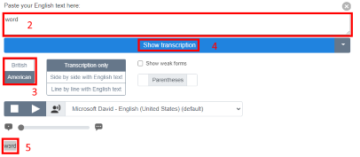
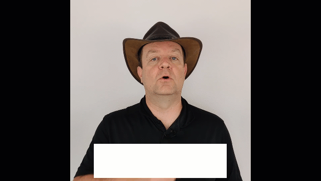

# Notes to the Synopsis template

The synopsis has two main goals:

- Help you plan your video so that the recording session and the editing go as easy and smoothly as possible.

- Help us understand your project so that we can approve it as fast as possible.

> Remember: the videos must be strictly under 2:20 so we can post them to Twitter. Aim for 2 minutes, keep them short and captivating! 

## Getting started

- [Copy the template here to your local drive](../templates/synopsis-template.md).
- Start creating: There are notes below.

## Phonetics

The goal of showing a phonetic transcription of the word is to create a feeling of being in a dictionary. You can easily create a new phonetics PNG with the following steps:

1. Go to https://tophonetics.com/.
2. Paste your english text in the box.

3. Make sure that `American` is selected. This is just to ensure that we have consistent phonetics through all the entries.
4. Click on `Show Transcription`.
5. Copy the transcription.
6. Open [Paint.net](https://www.getpaint.net/download.html) (or your favorite image editor).
7. Create a PNG with the transcription in parenthesis, for example:

> *Try to create an image close to this one for consistency*

> *This image uses the Calibri font at 192 pt*

> *[There is a template for Paint.NET here](../templates/Phonetics.pdn)*

8. Save the image in the [synopsis/images](../synopsis/images/) folder.

9. Include the image in your synopsis markdown.

## Topics

This section is intended as a notepad where you can quickly jot down some ideas about the video. For example when doing some research online, this is a convenient place to create a bullet points list, and to consult it later when you create the script.

## Keywords or key expressions

The list of keywords will be used to cross-reference items. They can be one word or a sort expression or 2-3 words. They can also be abbreviations.

For example, if you have this list of keywords in the app-service.md file:

`App Service, Web Server, Web API`

and another topic file has this text:

`[...] and you can install this application on a Web Server locally or in the cloud [...]`

then after processing, the text becomes

`[...] and you can install this application on a [Web Server](/topic/app-service) locally or in the cloud [...]`

> Important: A given keyword or key expression can only be used once on the whole site! When you submit your synopsis or your finished video, we will automatically check and let you know if you are using a keyword or key expression that is already used somewhere else, so we can work a solution out.

## Demos

We try to illustrate each topic with some small "demos" (note the quote signs here...). By this we mean that the demos are not necessarily aimed at showing a technical solution, but rather to illustrate the point you are making. The demos should be short (a few seconds), for example a quick action in the Azure portal, a navigation through some items, some screenshots, etc.

For "on camera" scenes, you can also add some logos in overlay to make things more interesting.

You can see a few examples of "demos" below.

> Click on the animated GIF to see the video

*Demo 1: Showing logos on the camera*

*Demo 2: Using callouts to attract attention*

*Demo 3: Showing logos on screen*

*Demo 4: Showing the Azure Portal*

*Demo 5: Fun with fingers*

*Demo 6: Animating screenshots*

## Links to docs

> TODO Links to docs

## Links to Learn

> TODO Links to Learn

## Script

> TODO Script

- Add production notes as a `> blockquote`

