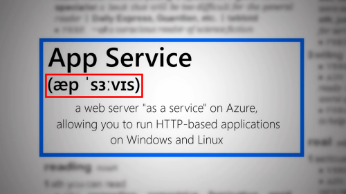

# Notes to the Synopsis template

The synopsis has two main goals:

- Help you plan your video so that the recording session and the editing go as easy and smoothly as possible.

- Help us understand your project so that we can approve it as fast as possible.

## Phonetics

The goal of showing a phonetic transcription of the word is mostly to create a feeling of being in a dictionary. You can easily create a new phonetics PNG with the following steps:

1. Go to https://tophonetics.com/.
2. Paste your english text in the box.

3. Make sure that `American` is selected. This is just to ensure that we have consistent phonetics through all the entries.
4. Click on `Show Transcription`.
5. Copy the transcription.
6. Open [Paint.net](https://www.getpaint.net/download.html) (or your favorite image editor).
7. Create a PNG with the transcription in parenthesis, for example:

> *Try to create an image close to this one for consistency*
> *This image uses the Calibri font at 192 pt*
> *[There is a template for Paint.NET here](../templates/Phonetics.pdn)*

8. Save the image in the [synopsis/images](../synopsis/images/) folder.

9. Include the image in your synopsis markdown.