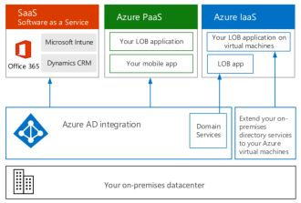
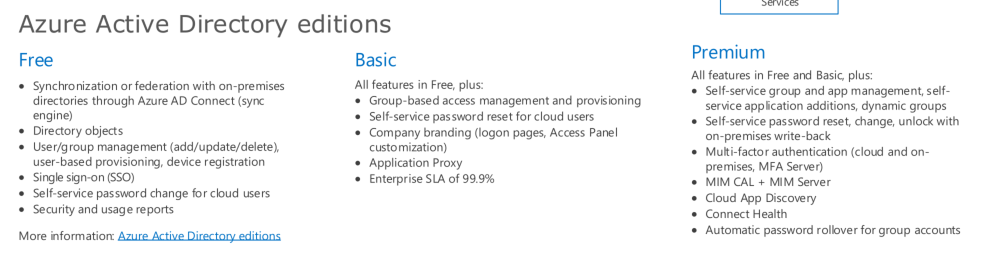

# Microsoft Glossary Synopsis: AAD

## Submitted by

Name: Laurent Bugnion

Email: lbugnion@microsoft.com

Twitter: @LBugnion

GitHub: LBugnion

> [This topic was published here](https://aka.ms/define/aad).

## Short description

an abbreviation meaning Azure Active Directory, a service used to manage identity, authentication and authorization on Microsoft Azure.

## Phonetics

eɪ-eɪ-diː

ˈæʒər

ˈæktɪv

dəˈrɛktəri

## Notes

- What does AAD stand for?
- Authentication and Authorization
- Editions
- Integration in MS Cloud, MS 365, PaaS, Windows 10.
- Using MFA.

## Keywords

AAD, Active Directory, Authorization, Authentication, Identity

## Demos

- Showing the [content of the poster here](https://www.microsoft.com/download/details.aspx?id=54431).
- Showing how to use the authenticator app to log into the Azure portal
  - Demo using Vysor to mirror the Android phone and show how fingerprint ID is used by the Authenticator app.

## Links to doc

- [https://docs.microsoft.com/azure/active-directory/fundamentals/active-directory-whatis](https://docs.microsoft.com/azure/active-directory/fundamentals/active-directory-whatis)
- [https://www.microsoft.com/download/details.aspx?id=54431](https://www.microsoft.com/download/details.aspx?id=54431)

## Links to Learn

- [What is Azure Active Directory?](https://docs.microsoft.com/learn/paths/manage-identity-and-access) (*learning path*)
- [Secure your identities by using Azure Active Directory](https://docs.microsoft.com/learn/modules/intro-to-azure-ad) (*module*)

## Script

Today's words are an abbreviation: AAD.

Hello and welcome to Microsoft Azure Words of the Day,
the show that teaches you Azure vocabulary!

> camera

AAD is short for Azure Active Directory.

> show phonetics

This is a fundamental component of Azure and has to do with security, or more specifically with identity and access management. It's sometimes called IDaaS, or Identity as a service.

> point finger 5 times and show the letters IDaaS, then below Identity as a service

AAD has wide applications to identify and authorize people, inside Azure of course but also inside your own organization. It can also be used to manage the identity of your users for third party cloud applications, or even to manage the identity of your customers.

There are different editions of AAD, Free Basic and Premium. Each edition has specific features, so make sure to check the documentation here.

> Show callout
> [https://docs.microsoft.com/azure/active-directory/fundamentals/active-directory-whatis](https://docs.microsoft.com/azure/active-directory/fundamentals/active-directory-whatis)

You can integrate with AAD at multiple levels: In the Microsoft cloud, with Microsoft 365 or any of our Platform as a Service offerings. In Windows 10 to join a device to an organization. It can also handle single sign-on, B2C and B2B and more.

> demo: authentication with MS Authenticator into Azure Portal

It's easy to use multi-factor authentication with AAD. For example by using the Microsoft Authenticator app, this is how I can use my fingerprint to confirm that I want to log into a Microsoft domain, for example the Azure Portal. Of course this also works for a wide range of sites and applications.

> camera

Azure Active Directory has a lot of great features and makes setting up identity services much easier than it used to be. So make sure to check all the links we assembled for you here! Thank you so much for watching Microsoft Azure Words of the Day. Today's word of the day was: AAD.
